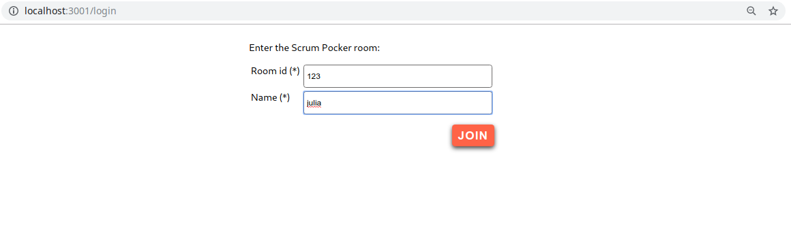
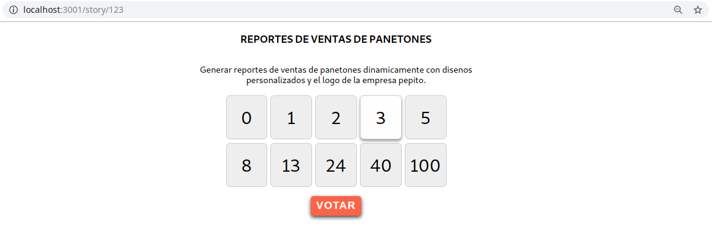
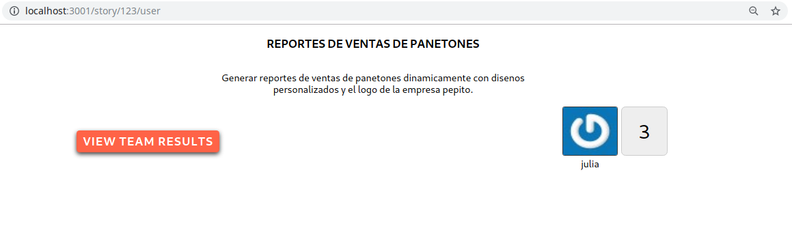
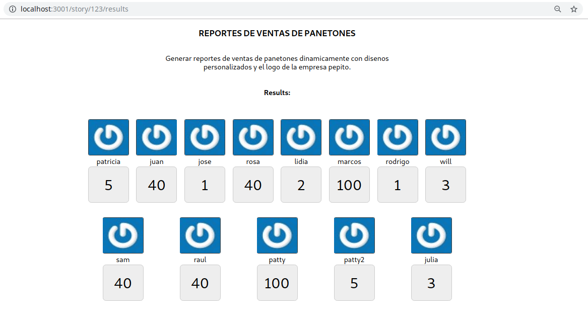

## Scrum Pocker

The scrum pocker session happens during sprint planning session. The product owner describes a feature to the
development team so they can create User Stories for the Backlog items which are the ones to be estimated
during the planning sessions. Each team member has provide estimation with the following vlaues: 0, 1, 2,
3, 5, 8, 13, 20, 40 and 100. These values  represent the story points that after a team conseus will be
asigned to the treated user story. In order to make transparent voting, the vote remains hidden until all
members agreed to open their estimations thus, we avoid influences or external factors that might impact
the estimations.
After everyone has voted the highest and lowest estimates explain their call and the process is repeated
until the team agress on a value.

### Available Scripts

In the project directory, you can run:

### Frontend side
- This is developed using React.

### Backend side
- This one is developed using nodejs, express and mongoDB as Data Base.

Each one has its own README and the requirements to run the project.

## An overview to the project

